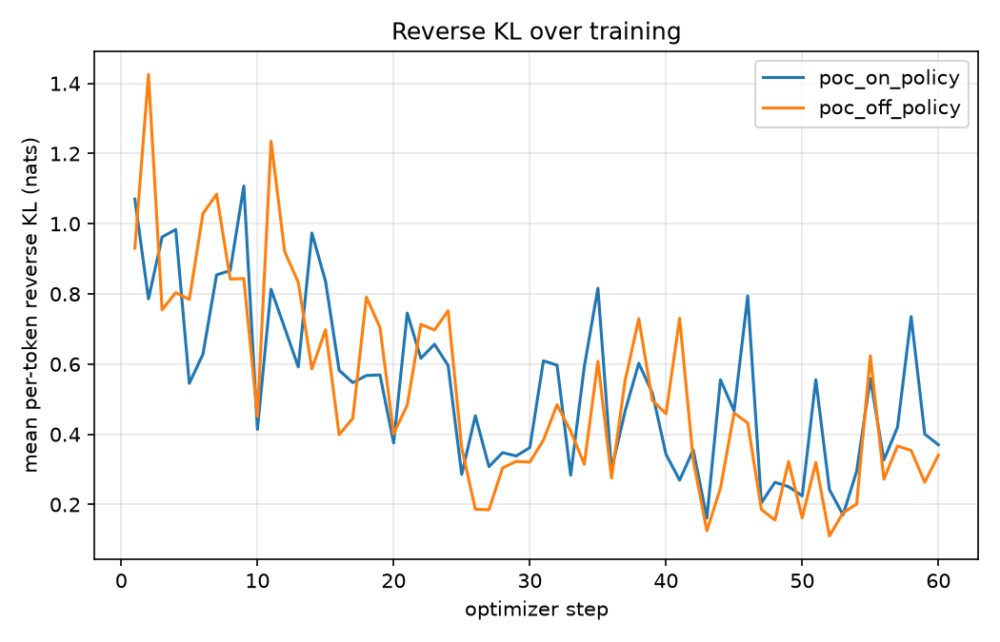
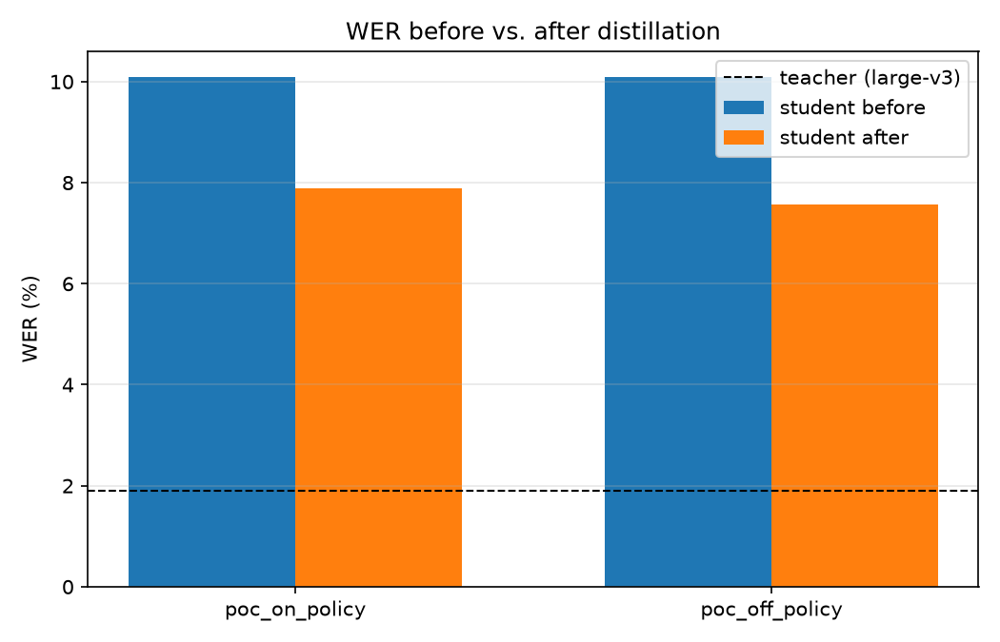
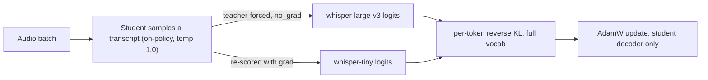

# On-Policy Distillation for ASR: whisper-tiny from whisper-large-v3

A small, reproducible proof of concept showing that **on-policy distillation** —
the technique behind recent LLM post-training recipes
([Agarwal et al., 2024](https://arxiv.org/abs/2306.13649);
[Thinking Machines Lab, 2025](https://thinkingmachines.ai/blog/on-policy-distillation/)) —
transfers cleanly to autoregressive speech recognition. We distill
[`openai/whisper-tiny`](https://huggingface.co/openai/whisper-tiny) (39M params) from
[`openai/whisper-large-v3`](https://huggingface.co/openai/whisper-large-v3) (1.55B params) by having the
teacher score the *student's own sampled transcripts*, rather than training on static
pseudo-labels. Everything runs on [Modal](https://modal.com)'s serverless CUDA GPUs.

**Real results from this repo, on a single Modal T4, for $0.16:**

| | student WER before | student WER after | mean reverse KL before | mean reverse KL after |
|---|---|---|---|---|
| **on-policy**  | 10.09% | **7.89%** | 0.633 | **0.496** |
| **off-policy** (pseudo-label baseline) | 10.09% | 7.57% | 0.633 | 0.524 |
| teacher (large-v3, reference ceiling) | 1.89% | — | — | — |

*(20 held-out clips, 60 optimizer steps, batch size 4 — see [Results](#results) for the full picture and honest caveats about scale.)*

<p align="center">
  
  
</p>

See [`PROPOSAL.md`](../PROPOSAL.md) for the Modal-credits pitch built on these numbers, and
[`references.bib`](../references.bib) for full citations.

## Table of contents

- [Background: what "on-policy" means for a generative model](#background-what-on-policy-means-for-a-generative-model)
- [Related work](#related-work)
- [Method](#method)
- [Whisper-specific subtleties](#whisper-specific-subtleties)
- [Experimental setup](#experimental-setup)
- [Results](#results)
- [How to run](#how-to-run)
- [Repository layout](#repository-layout)
- [Limitations and what a real run would need](#limitations-and-what-a-real-run-would-need)

## Background: what "on-policy" means for a generative model

Standard knowledge distillation ([Hinton et al., 2015](https://arxiv.org/abs/1503.02531)) trains a
small student to match a large teacher's *outputs*. For autoregressive sequence models — LLMs, and
equally Whisper-style ASR decoders — the classic recipe is **sequence-level KD**
([Kim & Rush, 2016](https://arxiv.org/abs/1606.07947)): generate a fixed dataset of teacher
transcripts (or teacher-scored logits) once, then train the student on it with cross-entropy or
KL. [Distil-Whisper](https://arxiv.org/abs/2311.00430) is exactly this pattern applied to Whisper:
large-scale teacher pseudo-labelling, a WER filter, then supervised fine-tuning of a smaller decoder.

The problem, identified for LLMs by [Agarwal et al. (2024)](https://arxiv.org/abs/2306.13649) ("GKD")
and [Gu et al. (2024)](https://arxiv.org/abs/2306.08543) ("MiniLLM"): a student trained only on the
teacher's sequences never sees *its own mistakes* during training. At inference time it
autoregressively conditions on its own (imperfect) prefix, a distribution it never trained on —
classic **exposure bias**, the same problem [DAgger](https://arxiv.org/abs/1011.0686)
(Ross et al., 2011) solved for imitation learning by querying the expert on the *learner's own*
visited states instead of a fixed expert trajectory.

**On-policy distillation** fixes this the DAgger way: sample a rollout from the *student*, then ask
the teacher to score that exact rollout, token by token. [Thinking Machines Lab (2025)](https://thinkingmachines.ai/blog/on-policy-distillation/)
popularized a simple, effective instantiation of this for LLM post-training: minimize the
**per-token reverse KL** between student and teacher at every state the student actually visits.
This PoC is that recipe, applied to Whisper.

## Related work

| Work | What it does | How this PoC relates |
|---|---|---|
| [Hinton et al., 2015](https://arxiv.org/abs/1503.02531) | Original knowledge distillation (soft targets) | Foundational; we use full-distribution KL rather than hard-label CE |
| [Kim & Rush, 2016](https://arxiv.org/abs/1606.07947) | Sequence-level KD for seq2seq models | The off-policy baseline we compare against |
| [Ross et al., 2011](https://arxiv.org/abs/1011.0686) | DAgger: query the expert on the learner's own states | The imitation-learning ancestor of "on-policy" distillation |
| [Radford et al., 2022](https://arxiv.org/abs/2212.04356) | Whisper: weakly-supervised ASR at 680k hours | The teacher/student model family used here |
| [Gandhi et al., 2023](https://arxiv.org/abs/2311.00430) | Distil-Whisper: large-scale pseudo-label KD for Whisper | Off-policy ASR distillation; we borrow its frozen-encoder design |
| [Gu et al., 2024](https://arxiv.org/abs/2306.08543) ("MiniLLM") | Reverse KL for distilling LLMs into smaller students | Motivates reverse KL specifically when the student is far smaller than the teacher (here, 40x) |
| [Agarwal et al., 2024](https://arxiv.org/abs/2306.13649) ("GKD") | On-policy + off-policy ablation, generalized divergences, for LLMs | The controlled on-policy-vs-off-policy experiment design we replicate |
| [Qwen Team, 2025](https://arxiv.org/abs/2505.09388) | Production use of on-policy distillation at scale | Evidence this isn't just an academic curiosity |
| [Thinking Machines Lab, 2025](https://thinkingmachines.ai/blog/on-policy-distillation/) | Per-token reverse KL as an RL-style advantage; practical recipe | The specific loss formulation this PoC implements |
| [Lin et al., 2026](https://arxiv.org/abs/2605.28139) ("Ark-ASR") | On-policy distillation *for ASR*, a 0.6B audio-LM from a Qwen-ASR teacher, at 100k training hours | **Direct prior art** — see below |
| [Li et al., 2026](https://arxiv.org/abs/2604.13016) | Analyzes when on-policy distillation works: student/teacher support compatibility | Explains why we validate on real, in-distribution LibriSpeech audio rather than out-of-domain speech |

**On prior art.** On-policy distillation for ASR is not new — [Ark-ASR](https://arxiv.org/abs/2605.28139)
(May 2026) already demonstrated it at real scale (0.6B student, 100k training hours, a Qwen-ASR
teacher). Ark-ASR's setting is harder in one specific way: its student and teacher use *different*
tokenizers, so it has to build a union top-k support and map token ids across vocabularies at every
position. **This PoC's contribution is a minimal, from-scratch, single-repo recipe for the Whisper
family specifically**, where student and teacher share (almost) the same tokenizer, so we can
compute an *exact, full-vocabulary* reverse KL — no top-k truncation, no cross-tokenizer alignment —
while still handling the one real vocabulary wrinkle Whisper does have (see below). It is designed to
be readable, cheap enough to run for pocket change, and to make the on-policy vs. off-policy
comparison directly, holding the loss function fixed (mirroring the ablation design in
[Agarwal et al., 2024, Table 1](https://arxiv.org/abs/2306.13649)).

## Method



1. **Rollout.** Sample a transcript from the student at temperature 1.0 — its own distribution,
   mistakes included ([Agarwal et al., 2024](https://arxiv.org/abs/2306.13649); [Thinking Machines Lab, 2025](https://thinkingmachines.ai/blog/on-policy-distillation/)).
2. **Teacher-forced scoring.** Run the teacher over that *exact* token sequence
   (`torch.no_grad()`), producing its next-token distribution at every position the student
   actually visited.
3. **Loss.** Mean per-token **reverse KL**, KL(student ‖ teacher), computed over the *full* shared
   vocabulary at every generated position:

   \[
   \mathcal{L} = \mathbb{E}_{y \sim \pi_{\text{student}}}\left[\frac{1}{T}\sum_{t=1}^{T} \sum_{v} \pi_{\text{student}}(v \mid y_{<t}) \left(\log \pi_{\text{student}}(v \mid y_{<t}) - \log \pi_{\text{teacher}}(v \mid y_{<t})\right)\right]
   \]

   Reverse KL is mode-seeking: it penalizes the student for putting probability mass where the
   teacher wouldn't, which matters when the student has far less capacity than the teacher — exactly
   our setting (tiny is ~40x smaller than large-v3), and the argument [Gu et al. (2024)](https://arxiv.org/abs/2306.08543)
   make for reverse KL over forward KL in this regime. Because both models are fully observable to
   us locally, we compute this **exactly** rather than via the single-token importance-weighted
   estimator used when working through a sampling-only API (as in the
   [Tinker cookbook](https://github.com/thinking-machines-lab/tinker-cookbook)'s
   `reverse_kl = sampled_logprob - teacher_logprob` — a valid single-sample Monte Carlo estimate of
   the same quantity, but higher-variance than the closed-form sum we use here).
4. **Backprop.** Re-score the student's own rollout with gradients enabled and step AdamW. The
   teacher is always frozen. Both encoders are frozen too (only the decoder is trained), following
   [Distil-Whisper](https://arxiv.org/abs/2311.00430)'s design — it keeps training cheap and the
   student's acoustic front-end untouched.

**Off-policy comparison arm.** To isolate the effect of *where the rollout comes from* (student vs.
teacher) from the effect of *which loss* is used, we hold the reverse-KL objective fixed and swap
only the rollout source: the off-policy arm samples from the teacher (classic pseudo-labelling,
à la Distil-Whisper) and re-scores the student on those teacher-generated sequences. This mirrors
the controlled ablation in [Agarwal et al. (2024), Table 1](https://arxiv.org/abs/2306.13649).

## Whisper-specific subtleties

Two details are easy to get wrong when porting this recipe from text LLMs (single tokenizer, single
input modality) to Whisper (two model sizes with different audio front-ends and a vocabulary that
changed between checkpoints):

**1. whisper-large-v3 uses 128 mel filterbanks; smaller checkpoints use 80.** Student and teacher
need *separate* `WhisperFeatureExtractor`s run over the same raw audio — using the teacher's
extractor output on the student (or vice versa) silently produces garbage.

**2. whisper-large-v3's vocabulary is not a superset-by-slicing of smaller checkpoints.**
large-v3 added one new token, `<|yue|>` (Cantonese), *inside* the language-token block. This shifts
every special token that comes after it — `<|translate|>`, `<|transcribe|>`, `<|notimestamps|>`, all
1,501 timestamp tokens — by **+1** relative to tiny/base/small/medium. (We also found the "no speech"
token is spelled `<|nocaptions|>` in the tiny tokenizer and `<|nospeech|>` in large-v3's — same slot,
different label.) A naive `logits[..., :51865]` slice to align the two vocabularies would silently
misalign roughly 1,500 special/timestamp columns in the KL sum, and would feed the *wrong* forced
prompt into whichever model didn't generate the rollout. We handle this properly:

- `build_vocab_map` ([`distill.py`](../src/onpolicy_distill/distill.py)) matches vocabularies by
  **token string** (with an explicit alias for the nocaptions/nospeech rename), producing an exact
  index-remapping tensor, validated by unit test to be injective and to fix known anchor tokens.
- `retarget_prefix` swaps in the *correct* model's own forced-prefix ids
  (`<|startoftranscript|><|en|><|transcribe|><|notimestamps|>`) whenever a sequence generated by one
  model is teacher-forced through the other — the prefix ids differ between checkpoints even though
  every actual transcript content token (the real BPE word tokens, plus end-of-transcript) is
  identical across the whole Whisper family.

Both are covered by unit tests in [`tests/test_distill_unit.py`](../tests/test_distill_unit.py).

**3. fp16 numerics.** An early version of this PoC ran both models in fp16 on the T4 (standard
practice for Whisper inference) and hit a CUDA `probability tensor contains inf, nan or element < 0`
assertion inside HF's sampling kernel — a known fp16-specific instability in `generate(do_sample=True)`,
not a bug in the KL/vocab-mapping logic (the identical code path is stable in fp32 on CPU). Both
models comfortably fit a T4's 16GB in fp32, so we simply run everything in fp32 and take the
(modest, measured) speed hit rather than chase fp16 edge cases in a PoC.

## Experimental setup

- **Student:** `openai/whisper-tiny` (39M params), fully trainable decoder, frozen encoder.
- **Teacher:** `openai/whisper-large-v3` (1.55B params), fully frozen.
- **Data:** [`hf-internal-testing/librispeech_asr_dummy`](https://huggingface.co/datasets/hf-internal-testing/librispeech_asr_dummy)
  — 73 real clips from LibriSpeech `clean`/`validation` ([Panayotov et al., 2015](https://doi.org/10.1109/ICASSP.2015.7178964)),
  the same split used in Hugging Face's official Whisper tutorials. 50 clips for training (cycled
  across steps), 20 disjoint held-out clips for evaluation. No auth, no gating, ~9MB — chosen
  specifically so the whole pipeline is reproducible by anyone with a Modal account and zero setup
  friction. See [`PROPOSAL.md`](../PROPOSAL.md) for the plan to scale to full LibriSpeech-960.
- **Optimizer:** AdamW, lr 1e-5, gradient clipping at norm 1.0, batch size 4, 60 steps per arm.
- **Hardware:** a single Modal `T4`, fp32.
- **Cost guardrail:** a pre-flight cost estimate (steps × assumed seconds/step × Modal's published
  `$/GPU-second`) must clear `--max-cost-usd` *before* any GPU container is requested; a second,
  measured re-estimate after a 3-step warmup can shrink the remaining step budget mid-run; the Modal
  function `timeout=` is the final hard backstop. See [`src/onpolicy_distill/config.py`](../src/onpolicy_distill/config.py)
  and [`modal_app.py`](../modal_app.py).

## Results

Full run: [`results/poc_20260828-080137_summary.json`](../results/poc_20260828-080137_summary.json)
(raw metrics, per-step KL log, and sample transcripts) — **total cost: $0.1575, total wall time: 961s (16 minutes)**
on a single Modal T4.

| Arm | Steps | Wall time | Est. cost | WER before → after | Mean reverse KL before → after |
|---|---|---|---|---|---|
| on-policy | 60/60 | 300.1s | $0.0492 | 10.09% → **7.89%** (−21.8% relative) | 0.633 → **0.496** (−21.6% relative) |
| off-policy | 60/60 | 643.0s | $0.1054 | 10.09% → 7.57% (−25.0% relative) | 0.633 → 0.524 (−17.3% relative) |
| teacher (large-v3) | — | — | — | 1.89% | — |

Both arms improve WER substantially over 60 steps on 50 training clips — meaningful evidence the
mechanism works end to end on real audio and a real 1.55B teacher, not just in a unit test.

The more interesting result is the **split between the two metrics**. On-policy training achieves
the *lower final reverse KL* — exactly the quantity it directly optimizes, since it scores the
student's own generation behavior — while off-policy training achieves a marginally *lower WER* at
this small scale. This is consistent with the distinction the literature draws between the two
methods: on-policy distillation directly corrects the mismatch between what the student would
generate and what the teacher judges good ("exposure bias"/distribution-shift correction), while
off-policy training on teacher-quality pseudo-labels is effectively imitation of *good* outputs
without ever confronting the student's own error modes. [Agarwal et al. (2024)](https://arxiv.org/abs/2306.13649)
and [Li et al. (2026)](https://arxiv.org/abs/2604.13016) both suggest the on-policy calibration
advantage tends to compound and generalize better over longer training and on harder/OOD inputs —
this PoC's 60-step, 50-clip budget is far too small to observe that compounding effect directly, and
we report the numbers as-is rather than oversell them. See [`PROPOSAL.md`](../PROPOSAL.md) for what a
run large enough to test that hypothesis would cost.

Sample transcripts (from the full run's baseline eval, before any training):

| Reference | Student (untrained) | Teacher (large-v3) |
|---|---|---|
| "IROLG LOOKED AMAZED AT THE SUDDEN FURY OF THE ATTACK THEN SMILED" | "I roll it up the maze at the sudden fear of the attack, then smile." | "Iroh looked amazed at the sudden fury of the attack, then smiled." |
| "THE KING HAS FLED IN DISGRACE AND YOUR FRIENDS ARE ASKING FOR YOU" | "The king is flooded disgrace and your friends are asking for you." | "The king is fled in disgrace and your friends are asking for you." |

(Full before/after transcripts for all evaluated clips are in the summary JSON.)

## How to run

Requires a [Modal](https://modal.com) account (free tier is enough for this PoC) and `MODAL_TOKEN_ID`
/ `MODAL_TOKEN_SECRET` (`modal token set ...`, or set as environment variables).

```bash
uv sync                                    # local dev env (torch/transformers for tests, modal CLI)
uv run pytest tests/ -q                    # fast CPU-only tests: math + a real tiny-model integration test

uv run modal run modal_app.py::hello       # near-zero-cost auth + image-build check (no GPU)
uv run modal run modal_app.py::smoke       # ~$0.03, both arms, 16 steps -- validates the full pipeline on GPU
uv run modal run modal_app.py::poc         # ~$0.16, both arms, 60 steps -- the real comparison, as reported above
```

Every GPU entrypoint accepts `--max-cost-usd` and refuses to launch if the pre-flight estimate
exceeds it (e.g. `modal run modal_app.py::poc --max-cost-usd 0.30`).

## Repository layout

Paths below are relative to the repo root (see the top-level
[`README.md`](../README.md) for how this OPD side-quest fits alongside the
audit work).

```
modal_app.py                          # Modal App: image, volumes, GPU function, CLI entrypoints
src/onpolicy_distill/
  config.py                           # DistillConfig, cost guardrail, presets (zero heavy deps)
  data.py                             # LibriSpeech loading + clip cycling
  distill.py                          # model loading, vocab alignment, rollouts, reverse-KL loss, training loop
  evaluate.py                         # WER (jiwer + Whisper's normalizer), mean reverse KL, sample transcripts
  plotting.py                         # loss-curve / WER-bar PNGs
tests/
  test_config.py                      # cost guardrail arithmetic (pure Python)
  test_distill_unit.py                # loss/masking/vocab-map math on synthetic tensors
  test_distill_integration_cpu.py     # full pipeline, real HF models, CPU-only (student == "teacher")
results/                              # metrics/plots from the actual Modal runs reported above
references.bib                        # full citations
PROPOSAL.md                           # the Modal-credits pitch built on these results
```

## Limitations and what a real run would need

This is a proof of concept, not a benchmark result: 50 training clips, 60 steps, one seed, one
language, one student/teacher pair. Specifically out of scope here (see `PROPOSAL.md` for the
scale-up plan and its GPU-hour/dollar cost, extrapolated from this run's *measured* throughput):

- **Scale.** Distil-Whisper trains on ~18,000 hours of pseudo-labelled audio; Ark-ASR uses 100,000
  hours. We use 73 clips (~9 MB). The direction of the effect (on-policy calibrating the student's
  own distribution) is demonstrated; whether it compounds into a durable WER advantage needs far
  more steps and data.
- **A single run, single seed.** No variance estimate across seeds or data splits.
- **English, read speech only.** No multilingual, no noisy/OOD audio, no long-form/timestamp
  transcription — precisely the conditions where Distil-Whisper and Whisper's own robustness claims
  are actually tested.
- **fp32 only**, for the numerical-stability reasons above; a production run would want to debug the
  fp16 path (or use bf16 on a GPU that supports it well) for real throughput.
- **No mixed on/off-policy curriculum or JSD-family objectives**, both of which
  [Agarwal et al. (2024)](https://arxiv.org/abs/2306.13649) find can outperform pure on-policy or
  pure off-policy training alone.
